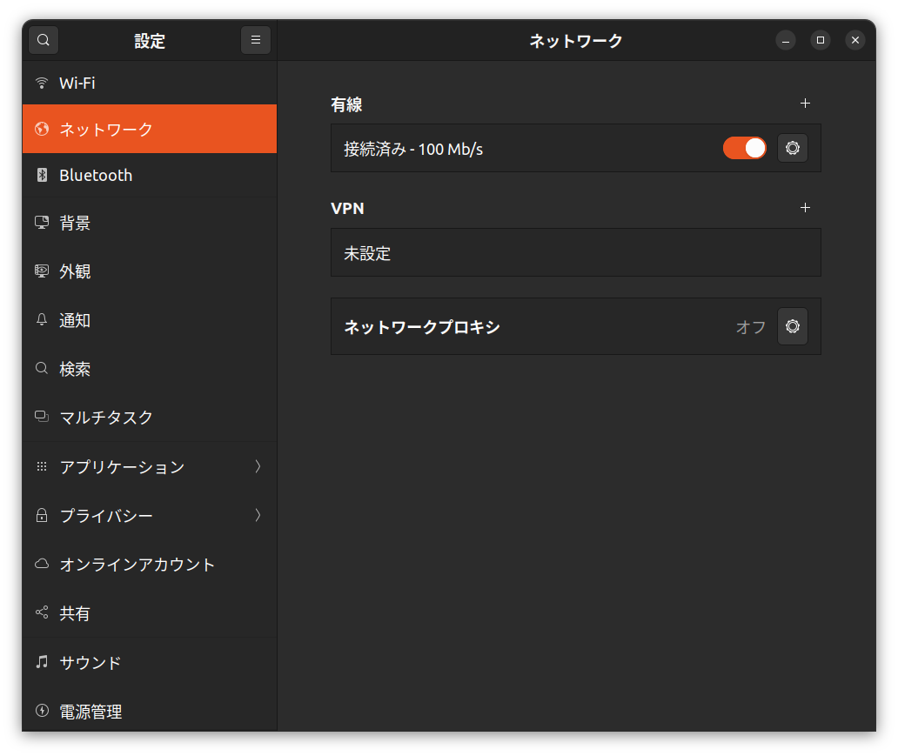
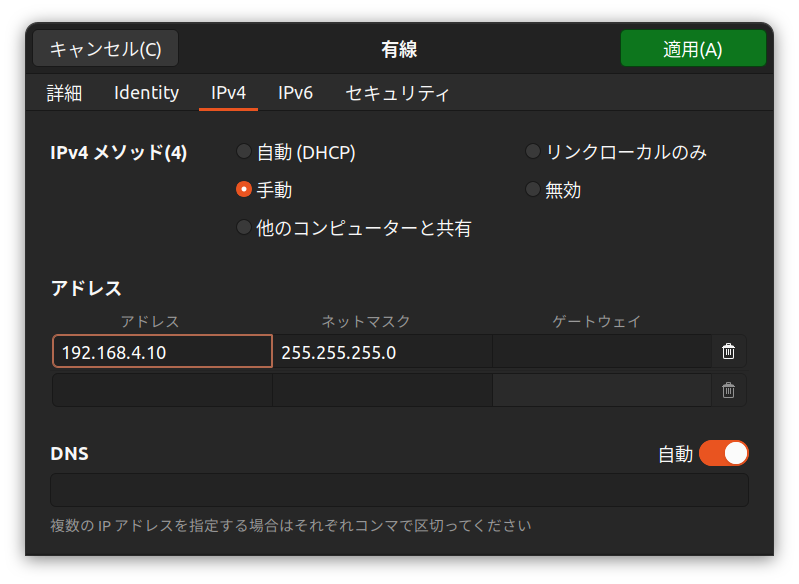
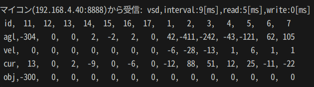

# V-Sido-Bilateral-ToPoArm-Kit デモプログラム


## 1. ToPoArm 動作概要

- ボタンの押下によって通常モードとバイラテラルモードを切替

- 通常モード
    - 関節角度をカンマ区切りで指示するとロボットが動作する
    - 接続がスレーブアームのみでも動作する
    - サーボは位置制御
    - 例(14個のサーボに0を指示する)
        - 0,0,0,0,0,0,0,0,0,0,0,0,0,0,
- バイラテラルモード
    - 力覚フィードバック付きのマスタスレーブ制御を実現する
    - スレーブアームは位置制御
    - マスターアームは位置トルク制御

- 各モード共通
    - 現在角度agl(10倍されたdegree)，現在速度vel(rpm)，現在電流cur(mA)，目標位置obj(10倍されたdegree)が出力される
    - 例：id11が現在 10 deg, 10rpm, 10mA, 目標角度 10 deg
        ```
        vsd,interval:10[ms],read:5[ms],write:1[ms]
        id,11,12,13,14,15,16,17,1,2,3,4,5,6,7
        agl,100,0,0,0,0,0,0,0,0,0,0,0,0,0
        vel,10,0,0,0,0,0,0,0,0,0,0,0,0,0
        cur,10,0,0,0,0,0,0,0,0,0,0,0,0,0
        obj,100,0,0,0,0,0,0,0,0,0,0,0,0,0
        ```

## 2. EtherNet 通信仕様
- IP，ポート番号
    マイコン：192.168.4.40:8888
    PC側：192.168.4.10:8886
    サブネットマスク:255.255.255.0
    ※ブロードキャストは使っていません 

## 3. セットアップ

1. Ubuntu 22.04以上が動くPCを用意する
2. USB有線LANアダプタなどのネットワークインターフェースをPCに接続し，LANケーブルでマイコンと接続する
3. ネットワーク設定を開き，有線接続をONにする

4. 有線LANの設定画面で，PCのIPアドレスを設定する

5. ネットワーク設定画面で再接続する
6. ターミナルでpingを実行して，接続できてるか確認する
```
ping 192.168.4.40
```

## 4. データの受信

- ToPoArmから角度などを受信するデモプログラムです
- ToPoArmは通常モードでも，バイラテラルモードでも実行できます

```
python3 receive.py
```



## 5. データの送信

- ToPoArmから角度などを送信するデモプログラムです
- ToPoArmは通常モードで実行してください

```
python3 send.py
```


## 6. 模倣学習

[こちらのページ](./lerobot/README.md)
